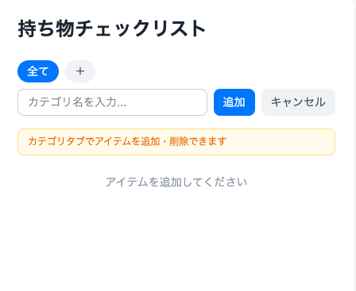
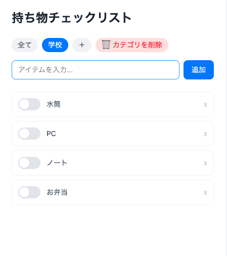
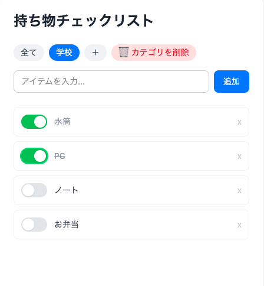

# 持ち物チェックリストアプリ

外出前の持ち物確認に使えるシンプルなチェックリストアプリです。学校・ジム・旅行など場面ごとにカテゴリを作り、持ち物を管理できます。

## 機能

- **カテゴリ管理** — 場面ごとにカテゴリを作成・削除
- **タブ切り替え** — 「全て」タブで全カテゴリのアイテムを一覧表示、各カテゴリタブで絞り込み表示
- **アイテムの追加** — テキスト入力または Enter キーで追加（カテゴリタブのみ）
- **チェック切り替え** — トグルボタンで確認済み／未確認を切り替え
- **アイテムの削除** — カテゴリタブ表示時に各アイテムを個別削除
- **自動保存** — データはブラウザの localStorage に自動保存

## 使い方

### カテゴリを作る

1. タブバー右端の「＋」ボタンをクリック
2. カテゴリ名を入力して「追加」または Enter キー
3. 作成したカテゴリタブに自動で切り替わる



### アイテムを追加する

1. カテゴリタブを選択（「全て」タブでは追加不可）
2. 入力欄にアイテム名を入力して「追加」または Enter キー



### 持ち物を確認する

- トグルボタンをクリックで確認済み（緑）／未確認（灰）を切り替え
- 「全て」タブでは全カテゴリのアイテムをまとめて確認できる



### カテゴリを削除する

1. 削除したいカテゴリタブをクリックしてアクティブにする
2. タブに表示される🗑アイコンをクリック（カテゴリとそのアイテムがまとめて削除される）

## 技術スタック

- [React 19](https://react.dev/)
- [TypeScript](https://www.typescriptlang.org/)
- [Vite](https://vitejs.dev/)
- [Tailwind CSS v4](https://tailwindcss.com/)

## 開発環境のセットアップ

```bash
# 依存パッケージのインストール
npm install

# 開発サーバーの起動
npm run dev
```

ブラウザで `http://localhost:5173` を開くと確認できます。

## ビルド

```bash
npm run build
```
